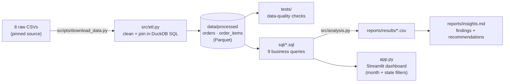

# E-commerce Analytics: Olist Marketplace

[](https://github.com/priyxnshu07/ecommerce-analytics/actions/workflows/ci.yml)
[](https://list-ecommerce-analytics.streamlit.app/)


End-to-end analysis of ~100,000 real orders from Olist, a Brazilian e-commerce marketplace: data cleaning in SQL, business analysis, an interactive dashboard and recommendations for operations and growth teams.

**[▶ Live dashboard](https://list-ecommerce-analytics.streamlit.app/)** · **[📄 Insights memo](reports/insights.md)**

---

## The project in brief (STAR)

**Situation.** Olist grew revenue 138% year on year, but growth alone doesn't show what limits the business. The raw data is spread across 8 tables, with duplicate reviews, missing dates and orders with no items.

**Task.** Turn the raw data into answers a manager can act on: what drives bad reviews, whether customers return, where revenue is concentrated, and what to do about it.

**Action.**
- Profiled and **cleaned 8 tables in SQL (DuckDB)**, documenting each decision (below), and locked the clean data in with **automated data-quality tests**.
- Answered **5 business questions with 9 SQL queries**: window functions, cohorts, Pareto analysis and RFM segmentation.
- Built an **interactive Streamlit dashboard** with month and state filters, and wrote an **insights memo** with 6 recommendations, each with an owner and a success metric.
- Set up **CI** that runs all tests and checks the committed results still match the SQL.

**Result.** Found that **late deliveries cause about a third of all 1–2-star reviews** while being only 6.8% of orders, and that the problem is concentrated in three states and in demand peaks. Fixing it could cut bad reviews by up to **28%**.

---

## Key findings

| Finding | Evidence |
| --- | --- |
| **Late deliveries drive bad reviews** | Late orders average **2.26★** vs **4.28★** on time; they are 6.8% of deliveries but **32.5%** of 1–2★ reviews |
| **Lateness is regional and seasonal** | Late rate **12–14%** in CE, BA and RJ vs **4.5%** in SP; **19%** in Mar 2018 vs a 6.8% average |
| **Delivery promises are padded** | Orders arrive in **12.5 days** on average vs **24.3** promised |
| **Customers rarely return** | Only **3.0%** order twice (median **28 days** later); repeat customers bring 5.6% of revenue |
| **A valuable segment is slipping away** | "Lost big spenders" are **14.7%** of customers but **28.8%** of revenue |
| **Revenue is concentrated** | Top 10% of sellers = **67%** of revenue; 7 of 74 categories = ~50% |

## Recommendations

1. **Fix delivery in RJ, BA and CE first** (carrier and seller dispatch review); measure the late rate against the SP benchmark.
2. **Pre-book carrier capacity** before Black Friday and Q1 peaks.
3. **Make promise dates route-specific** and alert customers before an order runs late.
4. **Re-engage customers 20–30 days after delivery** to lift the repeat rate.
5. **Win back "lost big spenders"** with a targeted campaign.
6. **Key-account management** for the top 10% of sellers.

Owners, evidence, success metrics and limitations are in the **[insights memo](reports/insights.md)**.

---

## How it works



## Business questions

| # | Question | Queries |
| --- | --- | --- |
| 1 | How are orders and revenue trending? | [`01_monthly_revenue`](sql/01_monthly_revenue.sql) |
| 2 | Do late deliveries hurt reviews, where, and by how much? | [`02_delivery_vs_reviews`](sql/02_delivery_vs_reviews.sql), [`02b_late_rate_by_state`](sql/02b_late_rate_by_state.sql), [`02c_late_delivery_impact`](sql/02c_late_delivery_impact.sql) |
| 3 | Do customers come back? | [`03_repeat_customers`](sql/03_repeat_customers.sql), [`03b_cohort_retention`](sql/03b_cohort_retention.sql) |
| 4 | Which categories and sellers drive revenue? | [`04_category_pareto`](sql/04_category_pareto.sql), [`04b_seller_concentration`](sql/04b_seller_concentration.sql) |
| 5 | Which customer segments matter most? (RFM) | [`05_rfm_segments`](sql/05_rfm_segments.sql) |

Results for each query are in [`reports/results/`](reports/results).

## Reproduce

```bash
python -m venv .venv && source .venv/bin/activate
pip install -r requirements.txt
python scripts/download_data.py   # raw CSVs, pinned to a fixed commit
python -m src.etl                 # clean tables -> data/processed/*.parquet
python -m src.analysis            # run sql/*.sql -> reports/results/*.csv
pytest                            # data-quality + analysis checks
streamlit run app.py              # dashboard at http://localhost:8501
```

The cleaned Parquet files are committed, so the dashboard, analysis and tests work without downloading the raw data.

## Testing

- **Data quality:** one row per order and per item, revenue reconciles between tables, no negative money, valid review scores, the late flag matches the delay, and the analysis window is 20 complete months.
- **Analysis:** every query runs and is deterministic; shares add up to 100% (catches double counting from a bad join); RFM covers every customer exactly once.
- **CI** runs both on every push and fails if the committed results drift from what the SQL produces.

## Data cleaning decisions

| Issue found while profiling | Decision |
| --- | --- |
| 2016 is sparse (no orders at all in Nov 2016); Sep–Oct 2018 are partial | Analyse Jan 2017 – Aug 2018 (20 complete months); other orders kept but flagged |
| Payments differ from items + freight on 249 orders (installment interest) | Revenue (GMV) = sum of item prices; freight reported separately |
| 775 orders have no items (mostly canceled or unavailable) | Zero revenue; excluded from revenue analysis |
| 555 orders have more than one review | Keep the most recent review |
| 610 products have no category; 2 categories lack an English name | Label `unknown`; translate the 2 manually |
| 8 "delivered" orders have no delivery date | Excluded from delivery metrics only |
| `customer_id` is new for every order | Identify customers by `customer_unique_id` (96,096 people) |

## Data source

[Brazilian E-Commerce Public Dataset by Olist](https://www.kaggle.com/datasets/olistbr/brazilian-ecommerce) (CC BY-NC-SA 4.0), downloaded from a [GitHub mirror](https://github.com/spdrio/Brazilian-E-Commerce-Public-Dataset-by-Olist) pinned to one commit.

---

Built by **Priyanshu Parashar** · [GitHub](https://github.com/priyxnshu07) · [LinkedIn](https://linkedin.com/in/priyanshu-p-24a682282)
